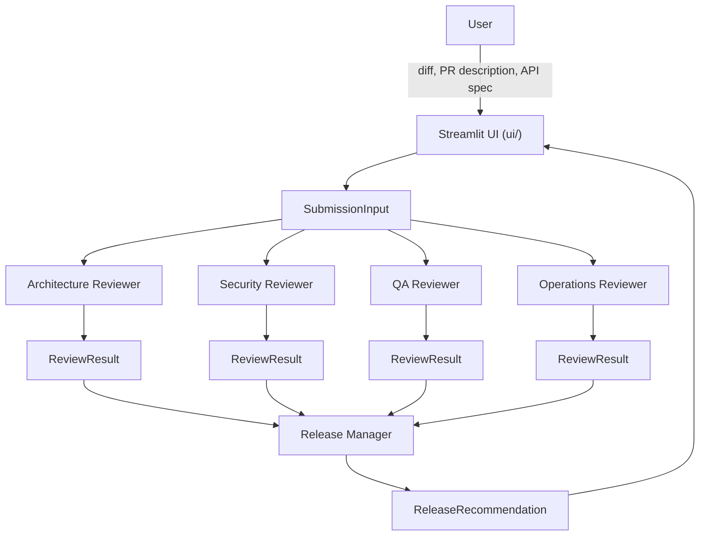

# Architecture — ReviewBoard AI

This document describes the technical design of the orchestration pipeline.
It is the source of truth for *how* the system is structured; see
[`PRODUCT_VISION.md`](./PRODUCT_VISION.md) for *why*.

## 1. High-level flow

Note what does **not** flow into the Release Manager: the `SubmissionInput`
(and therefore the raw diff) stops at the four diff-reviewers. The Release
Manager's only inputs are the four `ReviewResult` objects.

## 2. Orchestration pattern: fan-out / fan-in

The pipeline (`reviewboard/orchestration/pipeline.py`) is the only module
that knows the shape of the review board:

1. **Fan-out (parallel, independent):** `SubmissionInput` is sent to
   `ArchitectureReviewer`, `SecurityReviewer`, `QAReviewer`, and
   `OperationsReviewer` concurrently. These four calls have no dependency on
   one another, so they are natural candidates for concurrent execution
   (planned: the Cursor SDK's async client, one `AsyncAgent` call per
   reviewer, gathered together) rather than four sequential round-trips.
2. **Fan-in (sequential, dependent):** Once all four `ReviewResult`s are
   available, and only then, the `ReleaseManager` is invoked with the full
   set to produce a `ReleaseRecommendation`.

Reviewers never call each other and never know the pipeline exists — they
each expose a single `review(...)`-style method and are otherwise unaware of
their siblings. This keeps the single-responsibility boundary real at the
code level, not just at the prompt level.

## 3. Data contracts (`reviewboard/models/`)

Three models define every hand-off in the system:

| Model | Produced by | Consumed by | Carries the diff? |
|---|---|---|---|
| `SubmissionInput` | UI (from user upload) | The four diff-reviewers | Yes |
| `ReviewResult` | Each diff-reviewer | Release Manager, UI | No |
| `ReleaseRecommendation` | Release Manager | UI | No (references `ReviewResult`s only) |

Using explicit typed models instead of dicts or raw strings between stages
means:

- The Release Manager's isolation from the diff is a **type-level
  guarantee** — `ReleaseManager.review()` will be typed to accept
  `list[ReviewResult]`, so there is no parameter through which a diff could
  even be passed, let alone accidentally leak in.
- Every stage's output is validated and inspectable, which matters both for
  debugging and for rendering the "board" transparently in the UI.
- Reviewers are swappable/mockable in tests because their contract is a
  plain data shape, not a specific prompt or SDK call.

## 4. Reviewer isolation principle

Each reviewer module documents an explicit "out of scope" list (see the
docstrings in `reviewboard/reviewers/`). This is deliberate: in a review
board with overlapping concerns (e.g. security and operations both care
about secrets in config), ambiguity about ownership produces duplicated or
conflicting findings. Scope is fixed at the code/prompt level, not left to
each agent's discretion at runtime.

`BaseReviewer` (`reviewboard/reviewers/base.py`) defines the shared contract
for the four diff-reviewers: load a persona-specific prompt template, invoke
the Cursor SDK, and parse the structured response into a `ReviewResult`. The
`ReleaseManager` deliberately does **not** subclass `BaseReviewer` — its
input contract (`list[ReviewResult]`, no diff) is fundamentally different
from the other four (`SubmissionInput`), and forcing a shared base class
would blur that distinction.

## 5. Cursor SDK integration strategy

- **Invocation pattern:** each reviewer call is planned as a one-shot
  `Agent.prompt(...)` call — every review is a single independent judgment
  over a fixed input, not a multi-turn conversation, so there's no need for
  the durable `Agent.create` + `send` pattern or conversation state.
- **Concurrency:** the four diff-reviewers' one-shot calls are independent
  of each other, making them a fan-out candidate. Because the Python SDK is
  sync-by-default, concurrent execution will use the SDK's async client
  (`AsyncClient` / `AsyncAgent`) rather than a sync client shared across
  threads.
- **Runtime:** local execution (`local: cwd`) is the expected default for
  this prototype, since reviewers reason over an uploaded diff rather than a
  live repository checkout. Cloud execution is not required for this use
  case but the same reviewer contracts would work unchanged if that changed.
- **Model selection:** centralized in `reviewboard/config.py` rather than
  hardcoded per reviewer, so the whole board can be pointed at a different
  model (or a specific reviewer overridden) without touching reviewer code.
- **Structured output:** each reviewer's prompt will require a JSON response
  matching its `ReviewResult` schema; `BaseReviewer` owns parsing that
  response and surfacing malformed-output errors distinctly from agent
  execution errors.
- **Error handling:** the pipeline will distinguish (per the Cursor SDK's
  own model) a thrown `CursorAgentError` (the run never executed — auth,
  config, network) from a returned `result.status == "error"` (the run
  executed and failed) from a structured-output parse failure (the run
  succeeded but didn't conform to the expected schema). Each needs a
  different response; the exact partial-failure policy for the pipeline
  (e.g., can the Release Manager proceed with 3 of 4 reviews?) is deferred
  to the increment where the pipeline is implemented.

## 6. Prompts as data (`reviewboard/orchestration/prompts/`)

Each persona's system/instruction prompt lives in its own markdown file
rather than as an inline Python string. This keeps prompt engineering
reviewable and versionable independently of orchestration code, and makes
the Release Manager's "no diff" constraint visible at the prompt-authoring
level too — `release_manager.md` is structurally the only prompt template
that must never reference or expect diff content.

## 7. UI layer (`reviewboard/ui/`)

The Streamlit layer is intentionally thin:

- `sidebar.py` collects input and produces a `SubmissionInput` — nothing
  else.
- `results.py` renders `ReviewResult`s and a `ReleaseRecommendation` — it
  never constructs prompts or calls the SDK.
- `state.py` centralizes `st.session_state` access so reruns don't lose
  in-progress or completed pipeline results.

This boundary means `reviewboard/orchestration` and `reviewboard/reviewers`
can be exercised and tested with zero Streamlit dependency.

## 8. Extensibility: adding a sixth reviewer

Because the pipeline only depends on the shared `BaseReviewer` contract:

1. Add `reviewboard/reviewers/<new>_reviewer.py` implementing `BaseReviewer`.
2. Add `reviewboard/orchestration/prompts/<new>.md`.
3. Register the reviewer in the pipeline's fan-out list.
4. No changes required to `ReleaseManager`, other reviewers, or the UI
   layer's rendering logic (which iterates over whatever `ReviewResult`s it
   receives).

## 9. Testing strategy (planned)

`tests/` is scaffolded with a fixtures directory (`sample.diff`,
`sample_pr_description.md`, `sample_api_spec.yaml`) so pipeline tests can run
against a fixed, realistic submission. The plan is to test
`run_review_pipeline` against fake/mocked reviewer agents so tests don't
require live Cursor SDK calls, with a dedicated test asserting the Release
Manager's input never contains diff content — the single most important
architectural invariant in this system.

## 10. Explicit non-goals for this architecture

- No shared mutable state between reviewers.
- No reviewer-to-reviewer communication of any kind.
- No implicit context leakage into the Release Manager beyond the four
  `ReviewResult` objects.
- No coupling between the UI framework and orchestration/reviewer logic.
