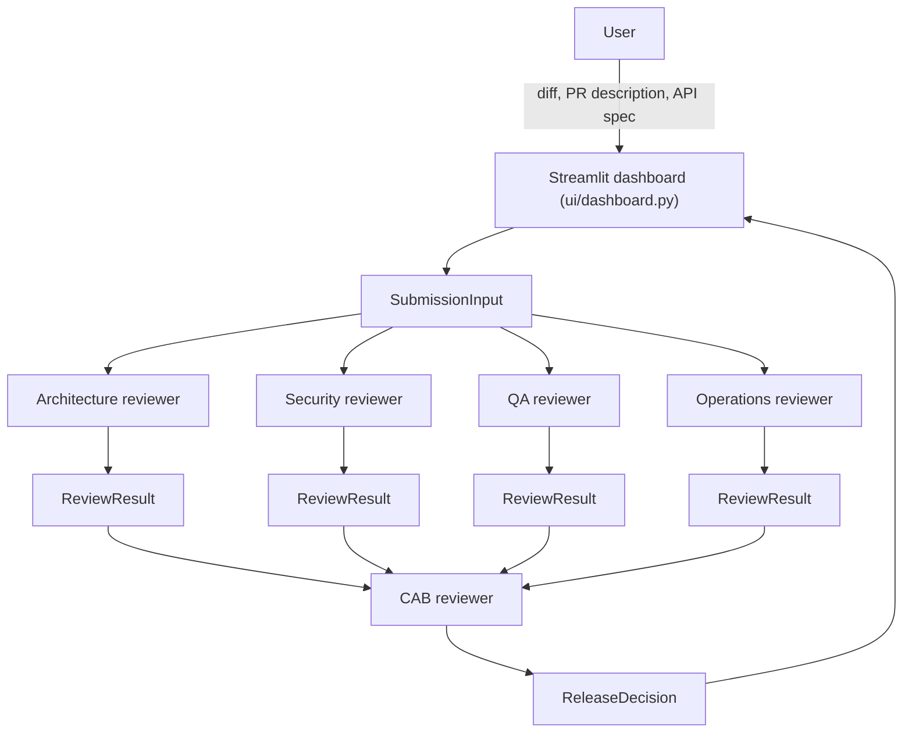

# Architecture — ShipReady AI

This document describes the technical design of the orchestration pipeline.
It is the source of truth for *how* the system is structured; see
[`PRODUCT_VISION.md`](./PRODUCT_VISION.md) for *why* and
[`PROJECT_CHARTER.md`](./PROJECT_CHARTER.md) for scope.

## 1. High-level flow

Note what does **not** flow into the CAB reviewer: the `SubmissionInput`
(and therefore the raw diff) stops at the four diff-reviewers. The CAB
reviewer's only inputs are the four `ReviewResult` objects.

## 2. Orchestration pattern: fan-out / fan-in

The pipeline (`orchestrator/pipeline.py`) is the only module that knows the
shape of the review board:

1. **Fan-out (parallel, independent):** `SubmissionInput` is sent to the
   Architecture, Security, QA, and Operations reviewers (`reviewers/`)
   concurrently. These four calls have no dependency on one another, so
   they are natural candidates for concurrent execution (planned: the
   Cursor SDK's async client, one `AsyncAgent` call per reviewer, gathered
   together) rather than four sequential round-trips.
2. **Fan-in (sequential, dependent):** Once all four `ReviewResult`s are
   available, and only then, the CAB reviewer (`reviewers/cab.py`) is
   invoked with the full set to produce a `ReleaseDecision`.

Reviewers never call each other and never know the pipeline exists — they
each expose a single review-style entry point and are otherwise unaware of
their siblings. This keeps the single-responsibility boundary real at the
code level, not just at the prompt level.

## 3. Data contracts (`models/review_models.py`)

Every hand-off in the system is defined by a typed model, all kept together
in one module for this stage of the project:

| Model | Produced by | Consumed by | Carries the diff? |
|---|---|---|---|
| `SubmissionInput` | `ui/dashboard.py` (from user input) | The four diff-reviewers | Yes |
| `ReviewResult` | Each diff-reviewer | CAB reviewer, dashboard | No |
| `ReleaseDecision` | CAB reviewer | Dashboard | No (references `ReviewResult`s only) |

Using explicit typed models instead of dicts or raw strings between stages
means:

- The CAB reviewer's isolation from the diff is a **type-level guarantee**
  — its entry point will be typed to accept `list[ReviewResult]`, so there
  is no parameter through which a diff could even be passed, let alone
  accidentally leak in.
- Every stage's output is validated and inspectable, which matters both for
  debugging and for rendering the "board" transparently in the dashboard.
- Reviewers are swappable/mockable in tests because their contract is a
  plain data shape, not a specific prompt or SDK call.

## 4. Reviewer isolation principle

Each module in `reviewers/` documents an explicit "out of scope" list. This
is deliberate: in a review board with overlapping concerns (e.g. security
and operations both care about secrets in config), ambiguity about
ownership produces duplicated or conflicting findings. Scope is fixed at
the code/prompt level, not left to each agent's discretion at runtime.

The four diff-reviewers (`architecture.py`, `security.py`, `qa.py`,
`operations.py`) share a common contract: load a persona-specific prompt
template from `prompts/`, invoke the Cursor SDK, and parse the structured
response into a `ReviewResult`. `cab.py` deliberately does **not** share
that contract — its input (`list[ReviewResult]`, no diff) is fundamentally
different from the other four (`SubmissionInput`), and forcing a shared
interface would blur that distinction.

## 5. Cursor SDK integration strategy

- **Invocation pattern:** each reviewer call is planned as a one-shot
  `Agent.prompt(...)` call — every review is a single independent judgment
  over a fixed input, not a multi-turn conversation, so there's no need for
  the durable `Agent.create` + `send` pattern or conversation state.
- **Concurrency:** the four diff-reviewers' one-shot calls are independent
  of each other, making them a fan-out candidate. Because the Python SDK is
  sync-by-default, concurrent execution will use the SDK's async client
  (`AsyncClient` / `AsyncAgent`) rather than a sync client shared across
  threads.
- **Runtime:** local execution (`local: cwd`) is the expected default for
  this prototype, since reviewers reason over an uploaded diff rather than a
  live repository checkout. Cloud execution is not required for this use
  case but the same reviewer contracts would work unchanged if that changed.
- **Model selection:** for this scaffolding increment, configuration (API
  key, default model) is expected to be read from environment variables
  (see `.env.example`) at the point of use; a dedicated settings module can
  be introduced in a later increment if per-reviewer overrides are needed.
- **Structured output:** each reviewer's prompt will require a JSON response
  matching its `ReviewResult` schema; the parsing/validation step will
  surface malformed-output errors distinctly from agent execution errors.
- **Error handling:** the pipeline will distinguish (per the Cursor SDK's
  own model) a thrown `CursorAgentError` (the run never executed — auth,
  config, network) from a returned `result.status == "error"` (the run
  executed and failed) from a structured-output parse failure (the run
  succeeded but didn't conform to the expected schema). Each needs a
  different response; the exact partial-failure policy for the pipeline
  (e.g., can the CAB reviewer proceed with 3 of 4 reviews?) is deferred to
  the increment where the pipeline is implemented.

## 6. Prompts as data (`prompts/`)

Each persona's system/instruction prompt lives in its own markdown file
rather than as an inline Python string. This keeps prompt engineering
reviewable and versionable independently of orchestration code, and makes
the CAB reviewer's "no diff" constraint visible at the prompt-authoring
level too — `cab.md` is structurally the only prompt template that must
never reference or expect diff content.

## 7. UI layer (`ui/dashboard.py`)

The Streamlit layer is intentionally thin and, at this stage, a single
module: it collects input and produces a `SubmissionInput`, triggers the
pipeline, and renders `ReviewResult`s and the final `ReleaseDecision`. It
never constructs prompts or calls the SDK directly. This boundary means
`orchestrator/` and `reviewers/` can be exercised and tested with zero
Streamlit dependency. If the dashboard's rendering responsibilities grow,
splitting it into input/results/state submodules is a natural follow-up
increment.

## 8. Supporting folders

- **`sample_data/`** — example diffs, PR descriptions, and API
  specifications for manually exercising the dashboard and for backing test
  fixtures. Tracked in git; content is added in a later increment.
- **`generated/`** — output artifacts produced by pipeline runs (e.g. saved
  review reports). The folder is tracked (via `.gitkeep`) but its generated
  contents are gitignored, since they're run output, not source.

## 9. Extensibility: adding a sixth reviewer

Because the pipeline only depends on the shared diff-reviewer contract:

1. Add `reviewers/<new>.py`.
2. Add `prompts/<new>.md`.
3. Register the reviewer in the pipeline's fan-out list
   (`orchestrator/pipeline.py`).
4. No changes required to `cab.py`, other reviewers, or the dashboard's
   rendering logic (which iterates over whatever `ReviewResult`s it
   receives).

## 10. Testing strategy (planned)

`tests/` is scaffolded with a fixtures directory (`sample.diff`,
`sample_pr_description.md`, `sample_api_spec.yaml`) so pipeline tests can run
against a fixed, realistic submission. The plan is to test
`run_review_pipeline` against fake/mocked reviewer agents so tests don't
require live Cursor SDK calls, with a dedicated test asserting the CAB
reviewer's input never contains diff content — the single most important
architectural invariant in this system.

## 11. Explicit non-goals for this architecture

- No shared mutable state between reviewers.
- No reviewer-to-reviewer communication of any kind.
- No implicit context leakage into the CAB reviewer beyond the four
  `ReviewResult` objects.
- No coupling between the UI framework and orchestration/reviewer logic.
